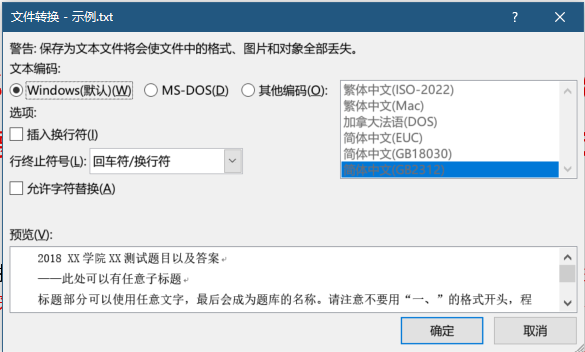

# 使用说明

## 功能介绍

本程序是一个简单的编译软件（Parser），用于将非结构化的文本格式编译为结构化的 `Moodle XML` 格式以方便导入乐学系统。

目前支持的功能有

- 单项选择题转换
- 判断题转换
- 支持任意文件编码的文本文件（有跨平台能力）
- 支持批量操作（对文件夹内文件进行统一转换）
- 有一定的报错提示能力（可以提示一些常见的错误）

## 源文件格式要求

详细的源文件格式要求请参考**示例文件**

## 操作步骤

### 1. 将Word保存为文本格式

1. 打开Word文件
2. 选择左上角 `文件` -> `另存为` 或者 `文件` -> `导出` 
3. 在保存时选择文本（.TXT）格式
4. 请将文件保存到一个空的文件夹下
5. 在文件转换这步直接点击确定即可（见下图）

### 2. 检查TXT文件保存情况

在极少数情况下，由于Word的版本问题，会导致TXT文本中出现一些问题。
此时需要使用者根据`示例`中的要求对TXT文本进行检查，以保证正确。（`示例`中的规则同时对Word文件和TXT文本有效）

不过大多数情况不需要进行这个步骤。但如果之后的转换出现异常，请检查进行该步骤的操作。

### 3. 运行程序

运行前的目录结构应该如下

- 转换程序
- 待转换文件存放目录/
    - 待转换文件一.txt
    - 待转换文件二.txt

然后在目录中，将`待转换文件存放目录` 的文件夹拖到`转换程序`的上方即可。

然后会弹出窗口显示程序转换过程。

在程序执行完成后，关闭窗口即可。

程序执行后的目录结构如下：

- 转换程序
- 待转换文件存放目录/
    - 核对信息/ (这部分数据存放程序对题目答案的判断，可以供操作人员验证转换中是否发生错误)
        - 待转换文件一-meta.txt
        - 待转换文件二-meta.txt
    - 导出数据/ （这部分数据是我们将要导入到乐学中的）
        - 待转换文件一-output.xml
        - 待转换文件二-output.xml
    - 待转换文件一.txt
    - 待转换文件二.txt

### 4. 检查转换正确性（可选）

本程序提供了转换过程中，程序对每道题正确答案的解析，因此可以通过该文件判断导出的数据是否正确。

### 5. 导入乐学

按照乐学的操作进行导入即可